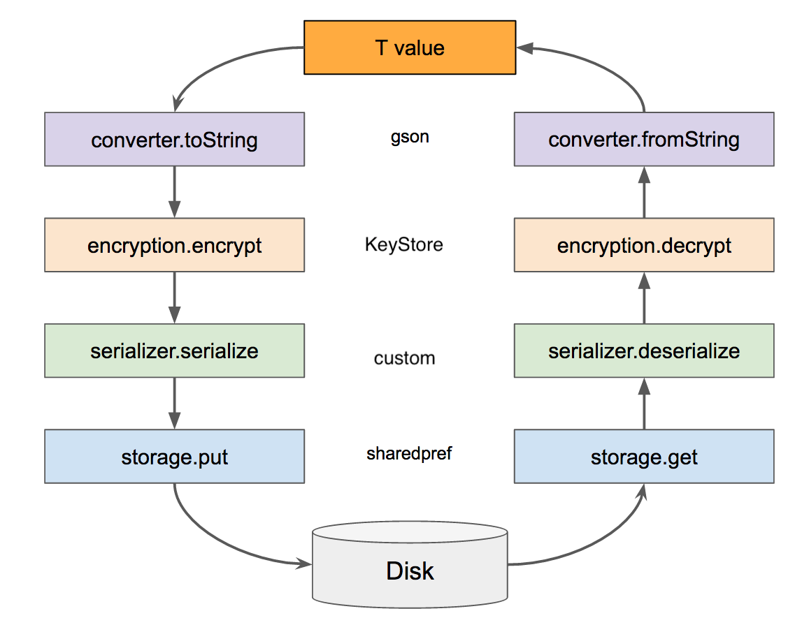
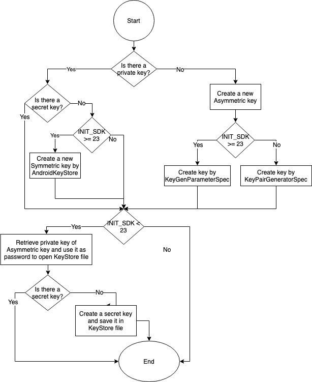

This project is based on [Hawk project](https://github.com/orhanobut/hawk) with some changes. The default encryption was replaced by a new encryption method which is based on AndroidKeyStore.
Also, the new encryption method inherits from [Secrets Keeper project](https://github.com/temyco/security-workshop-sample).

The below diagram illustrates steps of data storing which uses in this module.


You can implement your custom module based on the contracts for each sections of above diagram then inject it to module builder.

The below diagram illustrates flow of decision making in order to create keys.


### Usage

#### Initialize
```java
SecureStorage.SecureStorageBuilder builder = new SecureStorage.SecureStorageBuilder(getApplicationContext()).build();
```

By default Symmetric key (AES) is used to encrypt/decrypt data. You can change it as below:
```java
SecureStorage.SecureStorageBuilder builder = new SecureStorage.SecureStorageBuilder(getApplicationContext());
        builder.setAlgorithm(AlgorithmType.ASYMMETRIC);
        secureStorage = builder.build();
```

Also, you can add an LogInterceptor in order to log operations.
```java
        secureStorage = builder.setLogInterceptorModuleContract(new LogInterceptorModuleContract() {
            @Override public void onLog(String message) {
                Log.d("SecureStorage", message);
            }
        }).build();
```

#### Put data
```java
secureStorage.put("Key", "Value");
```

#### Get data
```java
secureStorage.get("key");
```

#### Get data count
```java
secureStorage.count();
```

#### Get existence of data
```java
secureStorage.contains("key");
```

#### Delete data
```java
secureStorage.delete("key");
```
## Note

### SDK limits
The encryption module is based on AndroidKeyStore, thus it doesn't supported APIs below 18 because there is no infrastructure for AndroidKeyStore.
In this situation(APIs below 18), the encryption module only (encrypt/decrypt)s data based on Base64.

### Encryption/Decryption algorithms
By default, AES and RSA are used to encrypt/decrypt data.

### Encryption/Decryption size limit
There is no limit to encrypt/decrypt by Symmetric keys. If you want to use Asymmetric keys, the data size limit will be 245 bytes.